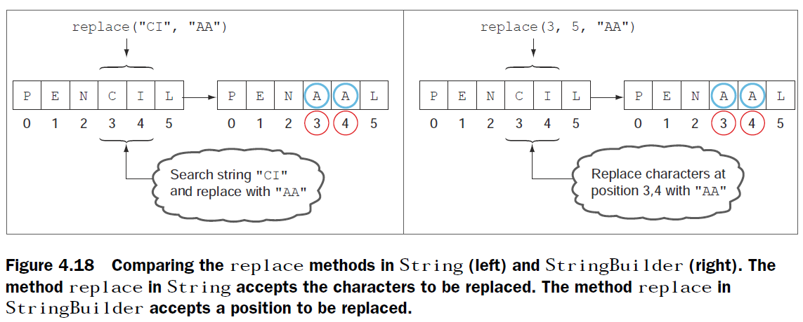

# Chapter 4: Selected classes from Java API and arrays <!-- omit in toc -->

[Back to Home](../Readme.md)

## Tables of Content <!-- omit in toc -->

- [String](#string)
  - [Creating String](#creating-string)
  - [String Methods](#string-methods)
    - [1. charAt()](#1-charat)
    - [2. indexOf()](#2-indexof)
    - [3. subString()](#3-substring)
    - [4. trim()](#4-trim)
    - [5. replace()](#5-replace)
    - [6. length](#6-length)
    - [7. startWith() & beginWidth()](#7-startwith--beginwidth)
  - [Operators](#operators)
- [StringBuilder](#stringbuilder)
  - [Comparison with String and StringBuffer](#comparison-with-string-and-stringbuffer)
  - [Creating StringBuilder](#creating-stringbuilder)
  - [StringBuilder methods](#stringbuilder-methods)
    - [1. append()](#1-append)
    - [2. insert()](#2-insert)
    - [3. delete() & deleteCharAt()](#3-delete--deletecharat)
    - [4. reverse()](#4-reverse)
    - [5. replace()](#5-replace-1)
    - [6. subSequence()](#6-subsequence)
- [Arrays](#arrays)
  - [What is an array](#what-is-an-array)
    - [1. Array declaration](#1-array-declaration)
    - [2. Array allocation](#2-array-allocation)
    - [3. Array intialization](#3-array-intialization)
    - [4. Combine declaration,allocation,intialization](#4-combine-declarationallocationintialization)
  - [Arrays of type interface,abstract class & class object](#arrays-of-type-interfaceabstract-class--class-object)
    - [Interface type](#interface-type)
    - [Abstract class type](#abstract-class-type)
    - [Class object](#class-object)
  - [Common examples](#common-examples)
    - [Compilation errors](#compilation-errors)
    - [Compiled but runtime exception](#compiled-but-runtime-exception)
    - [Acceptable](#acceptable)

## String

- Class. Default value is null.
> Class: A class defines object properties  
> Object: An instance of the class

- Immutable => Once created, a string value can't be modified. String methods that return a modified String value returned a new String object with the modified value. Original String value remains the same.

### Creating String

1. keyword **new**: String objects created this way is never pooled.
2. assignment operator: new String object created only if a String object with same value isn't found in String constant pool.

``` java
String str1 = new String("Paul");
String str2 = new String("Paul");
System.out.println(str1 == str2); //false

StringBuilder sd1 = new StringBuilder("String Builder");
String str5 = new String(sd1);
StringBufffer sd1 = new StringBufffer("String Buffer");
String str6 = new String(sd2);

String str3 = "Harry";
String str4 = "Harry";
System.out.println(str3 == str4); //true

System.out.println("Morning");

//Total of 6 String objects created in this example
```

### String Methods

> When chained, the methods are evaluated from left to right

#### 1. charAt()

- Retrieve character at a specified index of String
- *runtime exception* if non-existent index

``` java
String letters = "ABCAB";
System.out.println(letters.charAt(3)); //'A'
```

#### 2. indexOf()

- search for first matching position of char or String and return its index
- return -1 if no match
- By default, search from first char but you can also set starting position

``` java
String letters = "ABCAB";
System.out.println(letters.indexOf('B')); //-1
System.out.println(letters.indexOf("S")); //-1
System.out.println(letters.indexOf("CA")); //2
System.out.println(letters.indexOf('B',2)); //4
```

#### 3. subString()

- return a substring of a String from the position specified to the end of String
- substring method doesn't include character at end position
  - Length of String returned by subString = end - start

``` java
String letters = "ABCAB";
System.out.println(letters.subString(2)); //"CAB"
System.out.println(letters.subString(1,3)); //"BC"
```

#### 4. trim()

- return a new String by removing all leading and trailing *white space*(new lines,spaces or tabs) in a String
- method doesn't remove the space within a String

``` java
String letters = " AB CAB      ";
System.out.println(letters.trim()); //"AB CAB"
```

#### 5. replace()

- return a new String by replacing all occurences of a char/String with another char/String

``` java
String letters = "ABCAB";
System.out.println(letters.replace('B','b')); //"AbCAb"
System.out.println(letters.replace("CA",12)); //"AB12b"
```

#### 6. length

- return length of String

``` java
System.out.println(letters.replace("Shreya".length)); //5
```

#### 7. startWith() & beginWidth()

- return a new String by replacing all occurences of a char/String with another char/String

``` java
String letters = "ABCAB";
System.out.println(letters.replace('B','b')); //"AbCAb"
System.out.println(letters.replace("CA",12)); //"AB12b"
```

### Operators

- Concatenation: + and +=**

``` java
String aString = 10 + 12 + "OCJA";
System.out.println(aString); //"22OCJA"

//treating numbers as String values
aString = "" + 10 + 12 + "OCJA";
System.out.println(aString); //"1012OCJA"
```

- Equality: == and !=; equals()**

==  compares whether the reference variables refer to same objects, and method **equals** compares the String values for equality.  

``` java
String var1 = new String("Java");
String var2 = new String("Java");
System.out.println(var1 == var2); //false
System.out.println(var1.equals(var2)); //true

String var3 = "code";
String var4 = "code";
//var3 & var4 refer to same String object in String pool
System.out.println(var3 == var4); //true
System.out.println(var1.equals(var4)); //true
```

## StringBuilder

### Comparison with String and StringBuffer

- **String:** immutable. Creates new String objects instead of modifying existing one
- **StringBuilder:** mutable. Good for dealing with larger strings or modifying often. Single threaded to prevent inconsistencies in the values but additional overhead
- **StringBuffer:** same functionality and methods as StringBuilder but sychronized(multiple threads) where necessary.

### Creating StringBuilder

can be created using overloaded constructors

``` java
StringBuilder sb1 = new StringBuilder();
StringBuilder sb2 = new StringBuilder(sb1);
StringBuilder sb3 = new StringBuilder(50);
StringBuilder sb4 = new StringBuilder("Shreya Gupta");
```

### StringBuilder methods

- `charAt(),indexOf(),subString()` works the same as String class
- `trim()` not in StringBuilder. **Compilation error**

#### 1. append()

Insert data to end of StringBuilder object. Accept any data type *(boolean,int,char,double,String,char array,StringBuilder,Object etc)*

``` java
StringBuilder sb1 = new StringBuilder();
char[] name = {'J','a','v','a','8'};
System.out.println(sb1.append(name,1,3)); //ava

StringBuilder sb2 = new StringBuilder();
sb2.append("Java");
sb2.append(new Person("Oracle"));
//returns class name then @ and hexadecimal of object hash code
System.out.println(sb2) //JavaPerson@126b249
```

#### 2. insert()

Insert at any position. Accept any data type.

``` java
StringBuilder sb1 = new StringBuilder("Bon");
sb1.insert(2,'r');
System.out.println(sb1); //Born

StringBuilder sb2 = new StringBuilder("123");
char[] name = {'J','a','v','a','8'};
sb2.insert(1,name,1,3);
System.out.println(sb2); //1ava23
```

#### 3. delete() & deleteCharAt()

- delete removes substring
- deleteCharAt removes single char

``` java
StringBuilder sb1 = new StringBuilder("0123456");
sb1.delete(2,4); //exclude position 4
System.out.println(sb1); //01456

StringBuilder sb2 = new StringBuilder("0123456");
sb2.deleteCharAt(2);
System.out.println(sb2); //013456
```

#### 4. reverse()

reverse sequence of characters. Can't use method reverse to reverse a substring of StringBuider.

``` java
StringBuilder sb1 = new StringBuilder("0123456");
sb1.reverse(); //exclude position 4
System.out.println(sb1); //6543210
```

#### 5. replace()

Different from replace() in String class. Replaces sequence of characters, identified by their positions, with another String.

``` java
//StringBuilder
StringBuilder sb1 = new StringBuilder("0123456");
sb1.replace(2,4,"ABCD");
System.out.println(sb1); //01ABCD456
```



#### 6. subSequence()

similar to subString() but does not modify existing value

``` java
//StringBuilder
StringBuilder sb1 = new StringBuilder("0123456");
System.out.println(sb1.subSequence(2,4)); //23
System.out.println(sb1); //0123456
```

## Arrays

### What is an array

- An object that stores a collection of primitive data types or objects.
- multidimensional array can be asymmetrical with different number of columns for each rows.

#### 1. Array declaration

To declare an array, specfy its type followed by its name.  
Square brackets can follow by type or name.

> Arrays can be of any data type other than null 

``` java
int[] multiArr[];
int[][] multiArr;
int multiArr[][];

int anArr[];
int[] anArr;
```

#### 2. Array allocation

- Size must be integer.
- Size **can't expand or reduce** once allocated by keyword **new**.  
  i.e. array element can set null but cannot be removed
- Once allocated, array elements store their default values.

    | Array type          | Default |
    | ------------------- | :-----: |
    | object              |  null   |
    | byte,short,int,long |    0    |
    | boolean             |  false  |
    | char                | \u0000  |

``` java
int[] multiArr[];
multiArr = new int[2][3];
```

#### 3. Array intialization

``` java
int[] multiArr[];
multiArr = new int[2][3];
//Intialize by loop
for(int i=0;i<multiArr.length;i++){
    for(int j=0;j<multiArr[i].length;j++){
        multiArr[i][j] = i + j;
    }
}
//Intialize without using loop
multiArr[0][1] = 10;
multiArr[1][2] = 1210;
```

#### 4. Combine declaration,allocation,intialization

- Doesn't specify the array size. Size calculated by number of values assigned to array.
- Can initialize array without keyword **new**

``` java
String objArray[] = new String[] {"Harry","Shreya","Paul"}

int[][] a = {
    {1, 2, 3},{4, 5, 6, 9},{7}
};
```

### Arrays of type interface,abstract class & class object

#### Interface type

TODO

#### Abstract class type

TODO

#### Class object

TODO

### Common examples

#### Compilation errors

``` java
//No elements of array are created when declared.
int anArr[2];
//Array size missing
int intArr = new int[];
//Array size placed incorrectly
int intArr2[2] = new int[];
//Array size has to evalute to int
int intArr3 = new int[2.4];
//missing keyword new
int intArr4[];
intArr = {0,1};

int[] multiArr[];
//Mismatch in square brackets
multiArr = new int[];
//size in first square bracket missing
multiArr = new int[][]3;
```

#### Compiled but runtime exception

``` java
int intArr = new int[2];
System.out.println(intArr[3]);
System.out.println(intArr[-10]);
/*ArrayIndexOutOfBoundsException
Invalid array index value is passed in*/

String multiStrArr[][] = new String[][]{
    {"A","B"},null,{"Jan","Feb","Mar"}
}
```

#### Acceptable

``` java
String strArr = new String[2*5];
//Okay to defined size in only first square brackets
int multiArr[][] = new int[2][];
```
