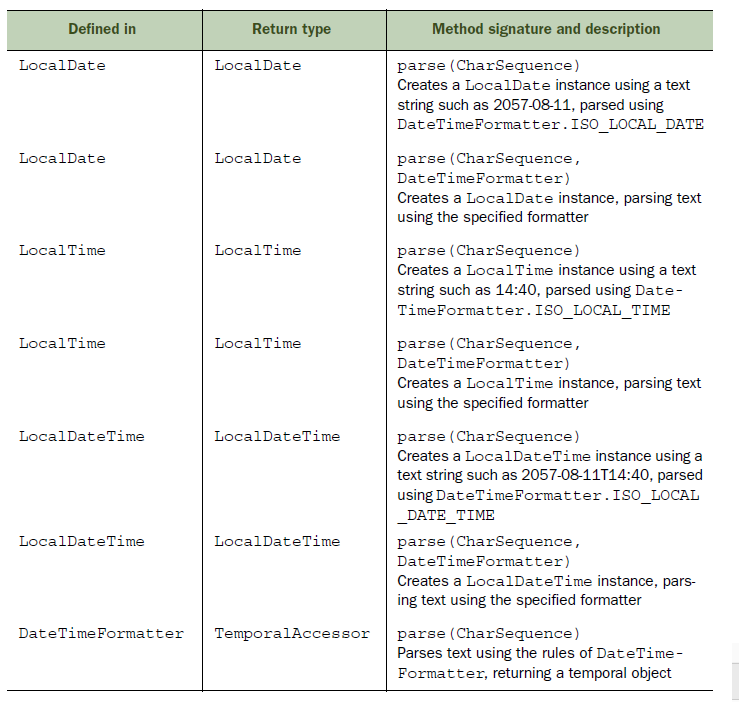

# Chapter 4: Selected classes from Java API and arrays <!-- omit in toc -->

[Back to Home](../Readme.md)

## Tables of Content <!-- omit in toc -->

- [String](#string)
  - [Creating String](#creating-string)
  - [String Methods](#string-methods)
    - [1. charAt()](#1-charat)
    - [2. indexOf()](#2-indexof)
    - [3. subString()](#3-substring)
    - [4. trim()](#4-trim)
    - [5. replace()](#5-replace)
    - [6. length()](#6-length)
    - [7. startWith() & beginWidth()](#7-startwith--beginwidth)
  - [Concatenation: + and +=](#concatenation--and)
  - [Equality: == and !=; equals()](#equality--and--equals)
- [StringBuilder](#stringbuilder)
  - [Comparison with String and StringBuffer](#comparison-with-string-and-stringbuffer)
  - [Creating StringBuilder](#creating-stringbuilder)
  - [StringBuilder methods](#stringbuilder-methods)
    - [1. append()](#1-append)
    - [2. insert()](#2-insert)
    - [3. delete() & deleteCharAt()](#3-delete--deletecharat)
    - [4. reverse()](#4-reverse)
    - [5. replace()](#5-replace-1)
    - [6. subSequence()](#6-subsequence)
- [Arrays](#arrays)
  - [What is an array](#what-is-an-array)
    - [1. Array declaration](#1-array-declaration)
    - [2. Array allocation](#2-array-allocation)
    - [3. Array intialization](#3-array-intialization)
    - [4. Combine declaration,allocation,intialization](#4-combine-declarationallocationintialization)
  - [Arrays of type interface,abstract class & object](#arrays-of-type-interfaceabstract-class--object)
    - [Interface](#interface)
    - [Abstract class](#abstract-class)
    - [Object](#object)
  - [Common examples](#common-examples)
    - [Compilation errors](#compilation-errors)
    - [Compiled but runtime exception](#compiled-but-runtime-exception)
    - [Acceptable](#acceptable)
- [ArrayList](#arraylist)
  - [What is an ArrayList](#what-is-an-arraylist)
  - [ArrayList methods](#arraylist-methods)
    - [1. Adding elements](#1-adding-elements)
      - [add()](#add)
      - [addAll](#addall)
    - [2. Iterating over elements](#2-iterating-over-elements)
      - [for loop](#for-loop)
      - [ListIterator](#listiterator)
    - [3. Removing elements](#3-removing-elements)
    - [4. Cloning an arraylist](#4-cloning-an-arraylist)
    - [5. Other methods](#5-other-methods)
- [Comparing object for equality](#comparing-object-for-equality)
  - [method equals](#method-equals)
    - [default implementation](#default-implementation)
    - [equals in user-defined class](#equals-in-user-defined-class)
    - [Violation of contract of *equals* method](#violation-of-contract-of-equals-method)
- [Calendar](#calendar)
  - [LocalDate](#localdate)
    - [1. Querying LocalDate](#1-querying-localdate)
    - [2. Comparing two LocalDate](#2-comparing-two-localdate)
    - [3. Modify LocalDate](#3-modify-localdate)
    - [4. Converting to LocalDateTime and epoch date](#4-converting-to-localdatetime-and-epoch-date)
  - [LocalTime](#localtime)
    - [LocalTime Methods](#localtime-methods)
  - [LocalDateTime](#localdatetime)
  - [Period](#period)
    - [Period Methods](#period-methods)
  - [DateTimeFormatter](#datetimeformatter)
    - [Instantiate DateTimeFormatter](#instantiate-datetimeformatter)
    - [format()](#format)
    - [parse()](#parse)

## String

QuickLinks: [String](#String); [StringBuilder](#stringbuilder); [Arrays](#arrays); [ArrayList](#arraylist); [Comparing object for equality](#comparing-object-for-equality); [Calendar](#calendar)

> Class: A class defines object properties  
> Object: An instance of the class

- Immutable sequence of characters. Default value is null
- None of the methods defined in class String can modify its value

### Creating String

1. keyword **new**: String objects created this way is never pooled.
2. assignment operator: new String object created only if a String object with same value isn't found in String constant pool.

``` java
String str1 = new String("Paul");

StringBuilder sd1 = new StringBuilder("String Builder");
String str5 = new String(sd1);
```

### String Methods

> When chained, the methods are evaluated from left to right

#### 1. charAt()

- Retrieve character at a specified index of String
- *runtime exception* if non-existent index

``` java
String letters = "ABCAB";
System.out.println(letters.charAt(3)); //'A'
```

#### 2. indexOf()

- search for first or specified matching position of char or String and return its index
- return -1 if no match

``` java
String letters = "ABCAB";
System.out.println(letters.indexOf('B')); //-1
System.out.println(letters.indexOf("CA")); //2
System.out.println(letters.indexOf('B',2)); //4
```

#### 3. subString()

- return a substring of a String from the position specified to the end of String
- doesn't include character at end position
  - Length of String returned by subString = end - start

``` java
String letters = "ABCAB";
System.out.println(letters.subString(2)); //"CAB"
System.out.println(letters.subString(1,3)); //"BC"
```

#### 4. trim()

- return a new String by removing all leading and trailing *white space*(new lines,spaces or tabs) in a String
- doesn't remove the space within a String

``` java
String letters = " AB CAB      ";
System.out.println(letters.trim()); //"AB CAB"
```

#### 5. replace()

- return a new String by replacing all occurences of a char/String with another char/String

``` java
String letters = "ABCAB";
System.out.println(letters.replace('B','b')); //"AbCAb"
System.out.println(letters.replace("CA",12)); //"AB12b"
```

#### 6. length()

``` java
System.out.println(("Shreya".length()); //6
```

#### 7. startWith() & beginWidth()

- return a new String by replacing all occurences of a char/String with another char/String

``` java
String letters = "ABCAB";
System.out.println(letters.replace('B','b')); //"AbCAb"
System.out.println(letters.replace("CA",12)); //"AB12b"
```

### Concatenation: + and +=

``` java
String aString = 10 + 12 + "OCJA";
System.out.println(aString); //"22OCJA"

//treating numbers as String values
aString = "" + 10 + 12 + "OCJA";
System.out.println(aString); //"1012OCJA"
```

### Equality: == and !=; equals()

==  compares whether the reference variables refer to same objects, and method **equals** compares the String values for equality.  

``` java
String var1 = new String("Java");
String var2 = new String("Java");
System.out.println(var1 == var2); //false
System.out.println(var1.equals(var2)); //true

String var3 = "code";
String var4 = "code";
//var3 & var4 refer to same String object in String pool
System.out.println(var3 == var4); //true
System.out.println(var1.equals(var4)); //true
```

## StringBuilder

QuickLinks: [String](#String); [StringBuilder](#stringbuilder); [Arrays](#arrays); [ArrayList](#arraylist); [Comparing object for equality](#comparing-object-for-equality); [Calendar](#calendar)

### Comparison with String and StringBuffer

- **String:** immutable. Creates new String objects instead of modifying existing one
- **StringBuilder:** mutable. Good for dealing with larger strings or modifying often. Single threaded to prevent inconsistencies in the values but additional overhead
- **StringBuffer:** same functionality and methods as StringBuilder but sychronized(multiple threads) where necessary.

### Creating StringBuilder

overloaded constructors which can accept either a String, StringBuilder,an int value to specify its capacity, or nothing

``` java
StringBuilder sb4 = new StringBuilder("Shreya Gupta");
```

### StringBuilder methods

- `charAt(),indexOf(),subString()` works the same as String class
- `trim()` not in StringBuilder. **Compilation error**

#### 1. append()

Insert data to end of StringBuilder object. Accept any data type *(boolean,int,char,double,String,char array,StringBuilder,Object etc)*

``` java
StringBuilder sb1 = new StringBuilder();
char[] name = {'J','a','v','a','8'};
System.out.println(sb1.append(name,1,3)); //ava

StringBuilder sb2 = new StringBuilder();
sb2.append("Java");
sb2.append(new Person("Oracle"));
//returns class name then @ and hexadecimal of object hash code
System.out.println(sb2) //JavaPerson@126b249
```

#### 2. insert()

Insert at any position. Accept any data type.

``` java
StringBuilder sb1 = new StringBuilder("Bon");
sb1.insert(2,'r');
System.out.println(sb1); //Born

StringBuilder sb2 = new StringBuilder("123");
char[] name = {'J','a','v','a','8'};
sb2.insert(1,name,1,3);
System.out.println(sb2); //1ava23
```

#### 3. delete() & deleteCharAt()

- delete removes substring
- deleteCharAt removes single char

``` java
StringBuilder sb1 = new StringBuilder("0123456");
sb1.delete(2,4); //exclude position 4
System.out.println(sb1); //01456

StringBuilder sb2 = new StringBuilder("0123456");
sb2.deleteCharAt(2);
System.out.println(sb2); //013456
```

#### 4. reverse()

reverse sequence of characters. Can't use method reverse to reverse a substring of StringBuilder.

``` java
StringBuilder sb1 = new StringBuilder("0123456");
sb1.reverse(); //exclude position 4
System.out.println(sb1); //6543210
```

#### 5. replace()

Different from replace() in String class. Replaces sequence of characters, identified by their positions, with another String.

``` java
//StringBuilder
StringBuilder sb1 = new StringBuilder("0123456");
sb1.replace(2,4,"ABCD");
System.out.println(sb1); //01ABCD456
```


#### 6. subSequence()

similar to subString() but does not modify existing value

``` java
//StringBuilder
StringBuilder sb1 = new StringBuilder("0123456");
System.out.println(sb1.subSequence(2,4)); //23
System.out.println(sb1); //0123456
```

## Arrays

QuickLinks: [String](#String); [StringBuilder](#stringbuilder); [Arrays](#arrays); [ArrayList](#arraylist); [Comparing object for equality](#comparing-object-for-equality); [Calendar](#calendar)

### What is an array

- An object that stores a collection of primitive data types or objects.
- multidimensional array can be asymmetrical with different number of columns for each rows.
- creation of array involves: declaration, allocation, initialization
- `length` : to find no. of elements in array. *[Note it is not length() like in String]*

#### 1. Array declaration

Composed of an array type, variable name, and one or more occurences of []. Creates a variable that refer to null

``` java
int[] multiArr[];
int[][] multiArr;
int multiArr[][];

int anArr[];
int[] anArr;
```

#### 2. Array allocation

- Allocate memory for the elements of an array
- Size must be integer.
- Size **can't expand or reduce** once allocated by keyword **new**.  
  i.e. array element can set null but cannot be removed
- Once allocated, array elements store their default values.

    | Array type          | Default |
    | ------------------- | :-----: |
    | object              |  null   |
    | byte,short,int,long |    0    |
    | boolean             |  false  |
    | char                | \u0000  |

``` java
int[] multiArr[];
multiArr = new int[2][3];
```

#### 3. Array intialization

``` java
int[] multiArr[];
multiArr = new int[2][3];
//Intialize by loop
for(int i=0;i<multiArr.length;i++){
    for(int j=0;j<multiArr[i].length;j++){
        multiArr[i][j] = i + j;
    }
}
//Intialize without using loop
multiArr[0][1] = 10;
multiArr[1][2] = 1210;
```

#### 4. Combine declaration,allocation,intialization

- Doesn't specify the array size. Size calculated by number of values assigned to array.
- Can initialize array without keyword **new**

``` java
String objArray[] = new String[] {"Harry","Shreya","Paul"}

int[][] a = {
    {1, 2, 3},{4, 5, 6, 9},{7}
};
```

### Arrays of type interface,abstract class & object

#### Interface

Elements are either null or objects that implement the relevant interface type.

``` java
interface MyInterface {}
class MyClass1 implements MyInterface {}
class MyClass2 implements MyInterface {}
MyInterface[] interfaceArr = new myInterface[]{
    new MyClass1(),null,new MyClass2()
}
```

#### Abstract class

Elements are either null or objects of concrete classes that extend the relevant abstract class.

``` java
abstract class Vehicle{}
class Car implements Vehicle {}
class Bus implements Vehicle {}
Vehicle[] vehiclerArr = new Vehicle[]{
    new Car(),new Bus(),null
}
```

#### Object

``` java
inerface MyInterface {}
class MyClass1 implements MyInterface{}
abstract class Vehicle{}
class Car implements Vehicle {}
Object[] ObjArr = new Object[]{
    new MyClass1(),null,new Car(),
    new java.util.Date(),new String("name"),
    new Integer[7]
}
```

### Common examples

#### Compilation errors

``` java
//No elements of array are created when declared.
int anArr[2];
//Array size missing
int intArr = new int[];
//Array size placed incorrectly
int intArr2[2] = new int[];
//Array size has to evalute to int
int intArr3 = new int[2.4];
//missing keyword new
int intArr4[];
intArr = {0,1};

int[] multiArr[];
//Mismatch in square brackets
multiArr = new int[];
//size in first square bracket missing
multiArr = new int[][]3;
```

#### Compiled but runtime exception

``` java
int intArr = new int[2];
System.out.println(intArr[3]);
System.out.println(intArr[-10]);
/*ArrayIndexOutOfBoundsException
Invalid array index value is passed in*/

String multiStrArr[][] = new String[][]{
    {"A","B"},null,{"Jan","Feb","Mar"}
}
```

#### Acceptable

``` java
String strArr = new String[2*5];
//Okay to defined size in only first square brackets
int multiArr[][] = new int[2][];
```

## ArrayList

QuickLinks: [String](#String); [StringBuilder](#stringbuilder); [Arrays](#arrays); [ArrayList](#arraylist); [Comparing object for equality](#comparing-object-for-equality); [Calendar](#calendar)

### What is an ArrayList

- ArrayList uses an array to store its element. However, it is **resizable** unlike array.
- Key properties
  - implements the interface
  - allows null and duplicate values
  - implements all list operations(add/modify/delete values)
  - maintains insertion order
  - use either Iterator or ListIterator to iterate
  - supports generic, making it type safe

``` java
//Missing object type on RHS -> works in Java 7 and above
ArrayList<String> myArrList = new ArrayList<>();
```

### ArrayList methods

#### 1. Adding elements

##### add()

``` java
ArrayList<String> myArrList = new ArrayList<>();
list.add("one");
list.add(1,"three"); //add in specified position
```

##### addAll

- `addAll(Collection<? extends E> c)` : appends all elements in specified collection to end of list
- `addAll(int index,Collection<? extends E> c)` : inserts all elements in specified collection into list, starting at specified position

``` java
ArrayList<String> myArrList = new ArrayList<>();
list.add("one");
list.add("two");
ArrayList<String> yourArrList = new ArrayList<>();
yourArrList.add("three");
yourArrList.add("four");

myArrList.addAll(1,yourArrList);
/*------------------------------------------------
- Elements in myArrList: one, three, four, two
- Elements of yourArrList aren't removed from it.
- Objects in yourArrList is referred from myArrList
-------------------------------------------------*/
```

> What happen if you modify common object references in these lists?  
> Case 1: Reassign object reference in either lists  
> &nbsp;&nbsp;&nbsp;&nbsp;Values in the other list remain unchanged  
> Case 2: Modify internals of any common list  
> &nbsp;&nbsp;&nbsp;&nbsp;Changes reflected in both lists

#### 2. Iterating over elements

##### for loop

Cannot to remove elements during iteration

``` java
ArrayList<String> myArrList = new ArrayList<>();
myArrList.add("One");
myArrList.add("Two");

//replace element at position 1("Two")
myArrList.set(1,"One and Half");
for(String element: myArrList){
    System.out.println(element);
}
```

##### ListIterator

Can remove elements during iteration

``` java
ListIterator<String> Iterator = myArrList.listIterator();
for(iterator.hasNext()){
    System.out.println(iterator.next());
}
```

#### 3. Removing elements

- `remove(int index)` : removes element at specified position in list
- `remove(Object o)` : removes first occurence of specified elemnt from list if present
- `clear()` : remove all elements

#### 4. Cloning an arraylist

`clone()` : returns a shallow copy i.e. element references are copied but the objects are not

``` java
ArrayList<StringBuilder> myArrList = new ArrayList<>();
StringBuilder sb1 = new StringBuilder("Jan");
StringBuilder sb2 = new StringBuilder("Feb");
myArrList.add(sb1);
myArrList.add(sb2);

/* myArrList and assigned refer to same object*/
ArrayList<StringBuilder> assigned = myArrList;
/* myArrList and assigned refer to different object*/
ArrayList<StringBuilder> cloned = (ArrayList<StringBuilder>)myArrList.clone();

System.out.println(myArrList == assigned);
System.out.println(myArrList == cloned);
```

#### 5. Other methods

- `get(int index)` : returns element at specified position
- `size()` : returns number of elements in this list
- `toArray()` : return an array containing all elements

> Methods below require strong understanding of equality.
> By default, objects are considered equal if they are referred to same variable (String class is an exception with its pool of String objects)

- `contains(Object o)` : returns true if list contains specified element
- `indexOf(Object o)` : returns index of first occurence of specified element or -1 if doesn't contain
- `lastIndexOf(Object o)` : returns index of last occurence of specified element or -1 if doesn't contain

``` java
ArrayList<StringBuilder> myArrList = new ArrayList<>();
StringBuilder sb1 = new StringBuilder("Jan");
myArrList.add(sb1);
System.out.println(myArrList.contains(new StringBuilder("Jan"));
//false
System.out.println(myArrList.contains(sb1));
//true
```

## Comparing object for equality

QuickLinks: [String](#String); [StringBuilder](#stringbuilder); [Arrays](#arrays); [ArrayList](#arraylist); [Comparing object for equality](#comparing-object-for-equality); [Calendar](#calendar)

### method equals

#### default implementation

compares whether two object variables refer to the same object.

``` java
//from java.lang.Object
public boolean equals(Object obj){
    return (this == obj);
}
```

#### equals in user-defined class

Dont't change method name(*equals*), return type(*boolean*) and parameter type(*Object*) when override in your class

``` java
class BankAccount {
    String acctNumber;
    int acctType;
    public boolean equals(Object anObject){
        //check whether comparing same type of object
        if(anObject instanceof BankAccount){
            BankAccount b = (BankAccount)anObject;
            //objects are equal if they have the same values
            return (acctNumber.euqlas(b.acctNumber) &&
                acctType == b.acctType)
        }
        return false;
    }
}
```

#### Violation of contract of *equals* method

- returns true for a null object passed to it  
- modifies value of any instance variables of the method parameter passed to it, or of the object on which it is called

``` java
//contract violation i.e. return true for null object
public boolean equals(Object anObject){
    return true;
}
```

## Calendar

QuickLinks: [String](#String); [StringBuilder](#stringbuilder); [Arrays](#arrays); [ArrayList](#arraylist); [Comparing object for equality](#comparing-object-for-equality); [Calendar](#calendar)

### LocalDate

LocalDate instances are immutable and hence safe to use in multithreaded environment. All methods that seem to maniputate its value return a copy of LocalDate instance.

``` java
//Accept month as int value
LocalDate date1 = LocalDate.of(2015,12,27);
//Accept month as enum constant
LocalDate date2 = LocalDate.of(2015,Month.DECEMBER,27);
//Get current date from system clock
LocalDate date3 = LocalDate.now();
//from string parsing. month and date values must two digits
//DateTimeParseException if incalid values is parsed
LocalDate date4 = LocalDate.parse("2025-08-09");
```

#### 1. Querying LocalDate

``` java
LocalDate date = LocalDate.parse("2020-08-30");
System.out.println(date.getDayOfMonth()); //30
System.out.println(date.getDayOfWeek()); //SUNDAY
System.out.println(date.getDayOfYear()); //243
System.out.println(date.getMonth()); //AUGUST
System.out.println(date.getMonthValue()); //8
System.out.println(date.getYear()); //2020
```

#### 2. Comparing two LocalDate

``` java
LocalDate shreyaBday = LocalDate.parse("2002-08-30");
LocalDate shreyaBday = LocalDate.parse("2002-07-29");
System.out.println(shreyaBday.isBefore(paulBday)); //true
System.out.println(shreyaBday.isAfter(paulBday)); //false
```

#### 3. Modify LocalDate

All additions,subtractions or replacements to LocalDate consider leap years

`minusXX()` : return copy of date instance after minusing specified days,months, or years to it

``` java
LocalDate bday = LocalDate.of(2052,03,10);
System.out.println(bday.minusDays(10)); //2052-02-29
System.out.println(bday.minusMonths(2)); //2052-01-10
System.out.println(bday.minusWeeks(30)); //2051-08-13
System.out.println(bday.minusYears(1)); //2051-03-10
```

`plusXX()` : return copy of date instance after adding specified days,months, or years to it

``` java
LocalDate bday = LocalDate.of(2016,02,29);
System.out.println(bday.plusDays(1)); //2016-03-01
System.out.println(bday.plusMonths(1)); //2016-03-29
System.out.println(bday.plusWeeks(7)); //2016-04-18
System.out.println(bday.plusYears(1)); //2017-02-28
```

`withXX()` : returns copy of date instance replacing the specified day,month,or year in it.

``` java
LocalDate bday = LocalDate.of(2036,02,28);
System.out.println(bday.withDayOfMonth(1)); //2036-02-01
System.out.println(bday.withDayOfYear(1)); //2036-01-01
System.out.println(bday.withMonth(7)); //2036-07-28
System.out.println(bday.withYears(1)); //0001-02-28
```

#### 4. Converting to LocalDateTime and epoch date

`atTime()` : Overloaded method. Return LocalDateTime, which stores both date and time. If pass invalid hours,minutes or seconds value to method, it will throw *DateTimeException*  

``` java
LocalDate dte = LocalDate.of(2016,02,28);
System.out.println(dte.atTime(16,30)); //2016-02-28T16:30
System.out.println(dte.atTime(16,30,20)); //2016-02-28T16:30:20
```

`toEpochDay()` : convert LocalDate to epoch date (count of days from January 1,1970)

### LocalTime

Immutable. Use 24-hour clock

``` java
LocaltTime timeHrsMin = LocalTime.of(12,12);
LocalTime timeHrsMinSec = LocalTime.of(0,12,6);
LocalTime time = LocalTime.parse("15:08:23");
//get current time
LocalDate date3 = LocalTime.now();
```

#### LocalTime Methods

- `getHour(),getMinute(),getSecond,getNano()`

- `isAfter(),isBefore()` :  
  check whether time is after or before specified time

- `minusHours(),minusMinutes(),minusSeconds(),minusNanos()`

- `plusHours(),plusMinutes(),plusSeconds(),plusNanos()`

- `withHours(),withMinutes(),withSeconds(),withNanos()` :  
  return copy of LocalTime with specified value altered

- `atDate()` : Combine with LocalDate to create LocalDateTime

### LocalDateTime

- LocalDateTime class use the letter T to separate date and time
- same methods as LocalDate and LocalTime

### Period

- represent a date-based amount in years,months and days.
- immutable
- can be defined as positive or negative
- When you initialize a Period with days more than 31 or months more than 12, it doesn't recalculate its years,months or days component  
  i.e. Adding a Period of 10 months to a Period of 5 months give 15 months not 1 year and 3 months

#### Period Methods

- `of(),ofYears(),ofMonths(),ofWeeks(),ofDays()`: Accept int values
- `parse(PnYnMnD) or parse(PnW)` : Parse from string, where n represents a number and letters(P,Y,M,D,W) represent parse,year,month,day and week
- `between()` : accepts two LocalDate and returns a Period. The first date is included, but the second date is excluded.
- `getYears(),getMonths(),getDays()`
- `isNegative()` : return true if any of three units of Period is negative
- `isZero` : Period is zero if all three units are zero
- `minus(Period),minusDays(),minusWeeks(),minusMonths(),minusYears()`
- `plus(Period),plusDays(),plusWeeks(),plusMonths(),plusYears()`
- `multipliedBy()` : modify all elements of a Period
- `toTotalMonths()` : return total number of months in the period by multplying the number of years by 12 and adding the number of months

### DateTimeFormatter

#### Instantiate DateTimeFormatter

- By calling ofLocalizedDate,ofLocalizedTime,and ofLocalizedDateTime method, passing it a FormatStyle value

| FormatStyle        | Example                 |
| ------------------ | ----------------------- |
| FormatStyle.FULL   | Saturday,August 11,2057 |
| FormatStyle.LONG   | August 11,2057          |
| FormatStyle.MEDIUM | Aug 11, 2057            |
| FormatStyle.SHORT  | 8/11/57                 |

- By access public static fields of DateTimeFormatter

``` java
DateTimeFormatter formatter5 = DateTimeFormatter.ISO_DATE;
```

| Formatter                         | Example                 |
| --------------------------------- | ----------------------- |
| Basic_ISO_DATE                    | 20570811                |
| ISO_DATE/ISO_LOCAL_DATE           | 2057-0-11               |
| ISO_TIME/ISO_LOCAL_TIME           | 14:30:15.312            |
| ISO_DATE_TIME/ISO_LOCAL_DATE_TIME | 2057-08-11T14:30:15.312 |

- By using the ofPattern() and passing it a string value

Note that an uppercase letter represents a bigger duration period. i.e. M is for a month and m is for minutes

``` java
DateTimeFormatter d1 = DateTimeFormatter.ofPattern("yyyy MM dd");
DateTimeFormatter d2 = DateTimeFormatter.ofPattern("Y M D");
DateTimeFormatter t1 = DateTimeFormatter.ofPattern("H h m s");
```

#### format()

- Formats a date or time object to a String using the rules of the formatter
- When calling format on a LocalDate, LocalTime, or LocalDateTime, pass a DateTimerFormmater as parameter.
- When calling format on a DateTimeFormatter, pass LocalDate, LocalTime, or LocalDateTime as method argument.

``` java
//formatter here defines rules to form a date object.
//runtime exception if time object is passed into this format
DateTimeFormatter formatter = DateTimeFormatter.ofLocalizedDate(FormatStyle.LONG);
LocalDate date = LocalDate.of(2057,8,11);
System.out.println(formatter.format(date));
```

#### parse()

To parse a date or time object, you can use either the static parse method in date/time objects or the instance parse method in the DateTimeFormatter.

